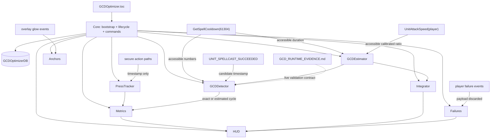

# Code graph

```mermaid
flowchart TD
  TOC["GCDOptimizer.toc"] --> Core["Core: bootstrap + lifecycle + commands"]
  Core --> DB[("GCDOptimizerDB")]
  Core --> Detector["GCDDetector"]
  Core --> Estimator["GCDEstimator"]
  Core --> Metrics["Metrics"]
  Core --> Integrator["Integrator"]
  Core --> HUD["HUD"]
  Core --> Press["PressTracker"]
  Core --> Failures["Failures"]
  Core --> Anchors["Anchors"]

  Spell["GetSpellCooldown(61304)"] -->|accessible numbers| Detector
  Spell -->|accessible duration| Estimator

  Swing["UnitAttackSpeed(player)"] -->|accessible calibrated ratio| Estimator
  Success["UNIT_SPELLCAST_SUCCEEDED"] -->|candidate timestamp| Detector
  Estimator --> Detector

  Action["secure action paths"] -->|timestamp only| Press
  Press --> Metrics
  Detector -->|exact or estimated cycle| Metrics
  Estimator --> Integrator
  Metrics --> HUD
  Integrator --> HUD

  CastFail["player failure events"] -->|payload discarded| Failures
  Failures --> HUD
  Overlay["overlay glow events"] --> Anchors

  Evidence["GCD_RUNTIME_EVIDENCE.md"] -. "live validation contract" .-> Detector
```
