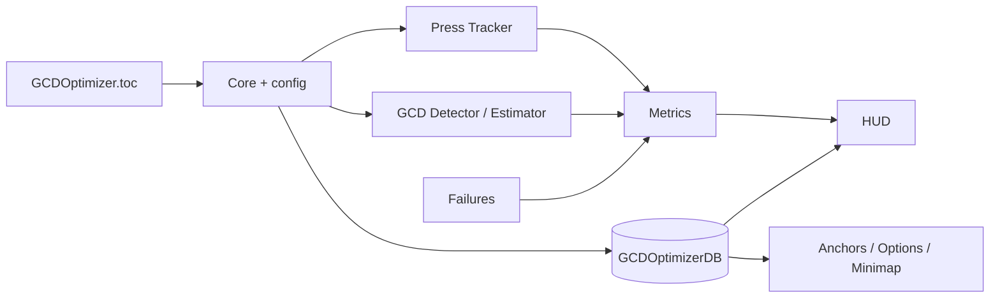

# Code graph

```mermaid
flowchart LR
  TOC["GCDOptimizer.toc"] --> Core["Core + config"]
  Core --> DB[("GCDOptimizerDB")]
  Core --> Press["Press Tracker"]
  Core --> Detect["GCD Detector / Estimator"]
  Press --> Metrics["Metrics"]
  Detect --> Metrics
  Fail["Failures"] --> Metrics
  Metrics --> HUD["HUD"]
  DB --> HUD
  DB --> Controls["Anchors / Options / Minimap"]
```
