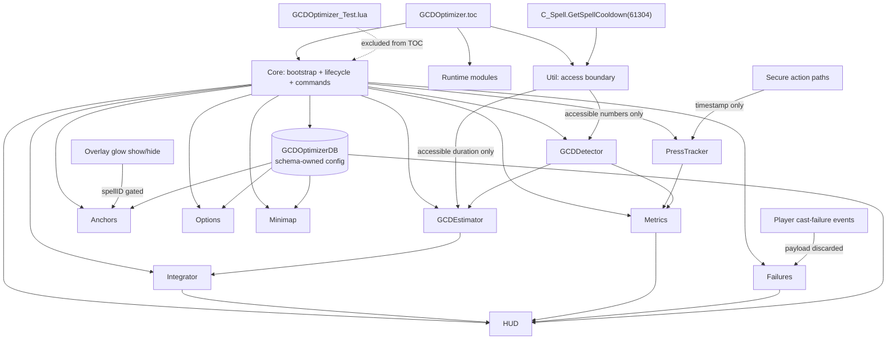

# Code graph

```mermaid
flowchart TD
  TOC["GCDOptimizer.toc"] --> Util["Util: access boundary"]
  TOC --> Modules["Runtime modules"]
  TOC --> Core["Core: bootstrap + lifecycle + commands"]

  Core --> DB[("GCDOptimizerDB\nschema-owned config")]
  Core --> Press["PressTracker"]
  Core --> Detector["GCDDetector"]
  Core --> Estimator["GCDEstimator"]
  Core --> Integrator["Integrator"]
  Core --> Metrics["Metrics"]
  Core --> Failures["Failures"]
  Core --> Anchors["Anchors"]
  Core --> HUD["HUD"]
  Core --> Options["Options"]
  Core --> Minimap["Minimap"]

  Action["Secure action paths"] -->|timestamp only| Press
  Press --> Metrics

  Spell["C_Spell.GetSpellCooldown(61304)"] --> Util
  Util -->|accessible numbers only| Detector
  Util -->|accessible duration only| Estimator
  Detector --> Metrics
  Detector --> Estimator
  Estimator --> Integrator
  Integrator --> HUD
  Metrics --> HUD

  CastFail["Player cast-failure events"] -->|payload discarded| Failures
  Failures --> HUD

  Overlay["Overlay glow show/hide"] -->|spellID gated| Anchors

  DB --> HUD
  DB --> Options
  DB --> Minimap
  DB --> Anchors

  Test["GCDOptimizer_Test.lua"] -. "excluded from TOC" .-> Core
```
