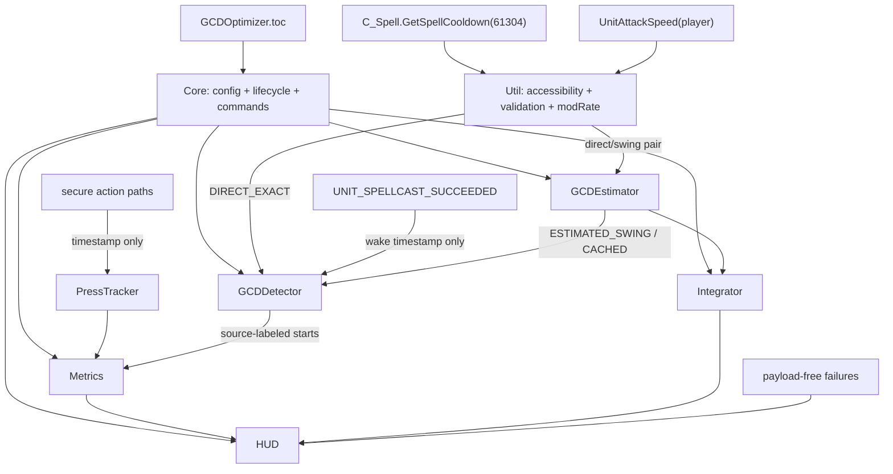

# Code graph

```mermaid
flowchart TD
  TOC["GCDOptimizer.toc"] --> Core["Core: config + lifecycle + commands"]
  Core --> Detector["GCDDetector"]
  Core --> Estimator["GCDEstimator"]
  Core --> Metrics["Metrics"]
  Core --> Integrator["Integrator"]
  Core --> HUD["HUD"]

  Cooldown["C_Spell.GetSpellCooldown(61304)"] --> Boundary["Util: accessibility + validation + modRate"]
  Swing["UnitAttackSpeed(player)"] --> Boundary
  Boundary -->|DIRECT_EXACT| Detector
  Boundary -->|direct/swing pair| Estimator
  Success["UNIT_SPELLCAST_SUCCEEDED"] -->|wake timestamp only| Detector
  Estimator -->|ESTIMATED_SWING / CACHED| Detector

  Actions["secure action paths"] -->|timestamp only| Press["PressTracker"]
  Press --> Metrics
  Detector -->|source-labeled starts| Metrics
  Estimator --> Integrator
  Metrics --> HUD
  Integrator --> HUD
  Failures["payload-free failures"] --> HUD
```
